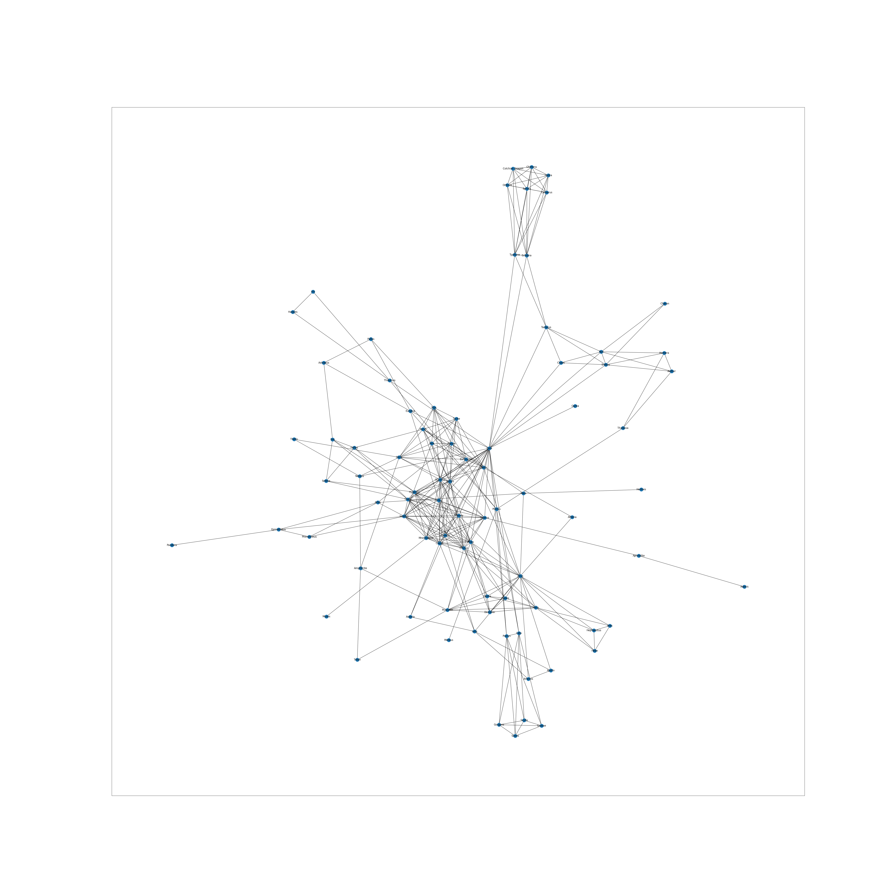
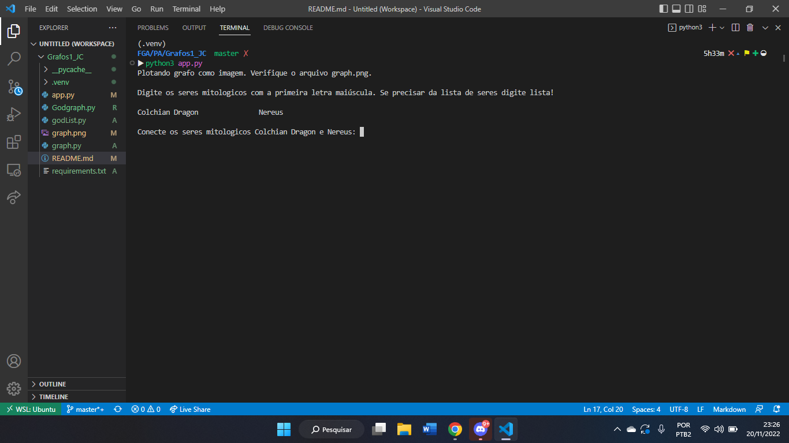
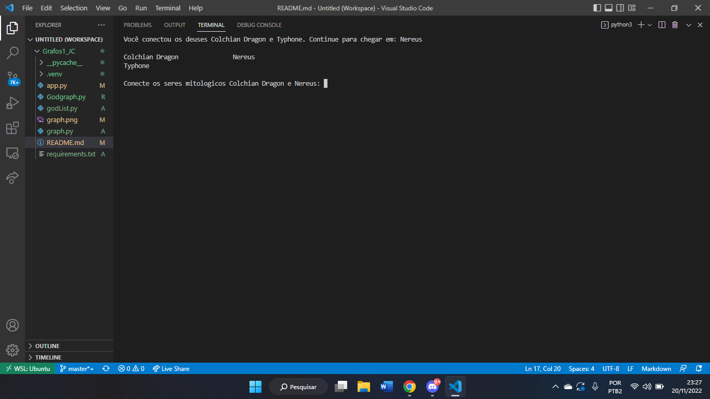
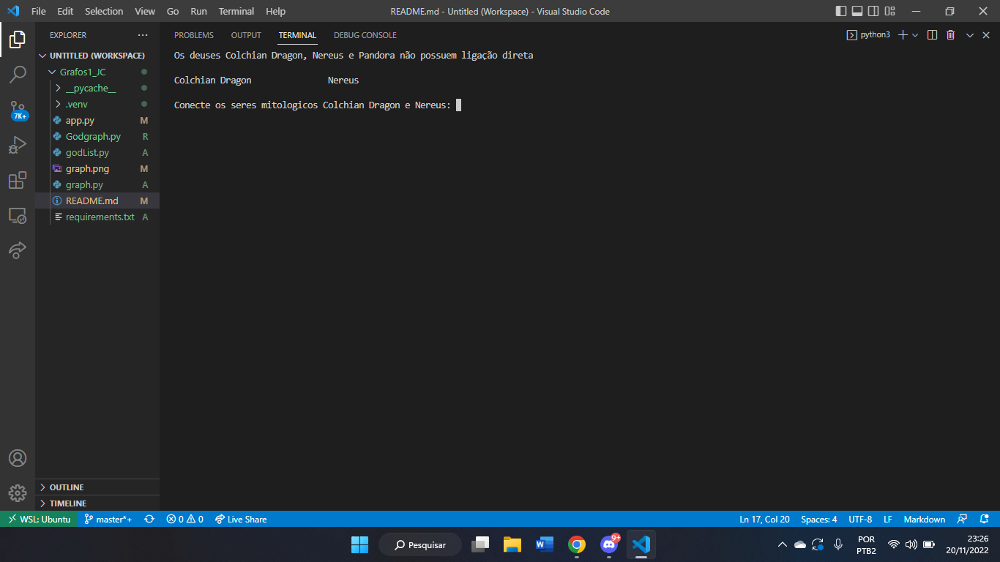
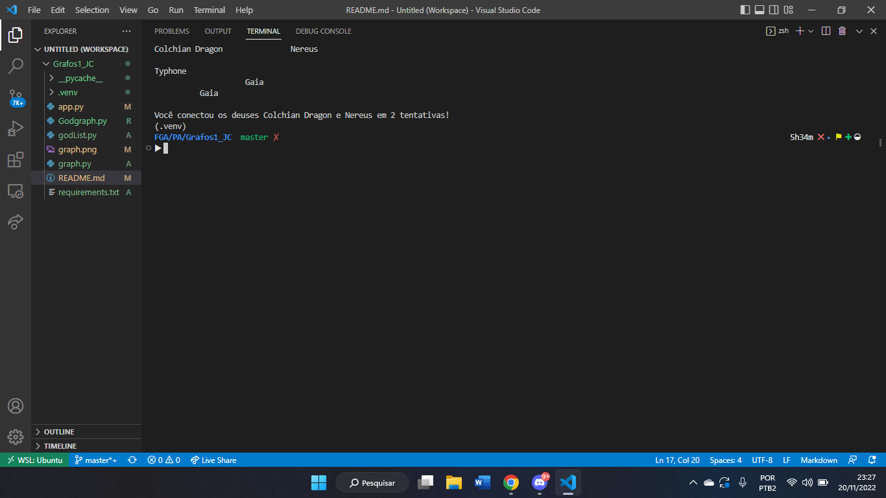

# JC

**Número da Lista**: 7<br>
**Conteúdo da Disciplina**: Grafos 1<br>

## Alunos
|Matrícula | Aluno |
| -- | -- |
| 18/0099353  | Cibele Freitas Goudinho |
| 16/0127327  | João Paulo Coelho de Souza |

## Sobre 
Esse projeto é um jogo para que o usuário consiga encontrar ligação entre dois seres (inclui titãs, deuses, semi-deuses e criaturas mitológicas) distintos da mitologia grega. Para isso, utilizamos busca em largura (BFS) entre os seres gerados aleatoriamente pelo programa e o ser digitado pelo usuário, assim verificando se há conexão direta entre o que foi digitado e o que foi gerado pelo sistema. 

## Screenshots






## Instalação 
**Linguagem**: Python<br>
**Framework**: N/A<br>
### Requisitos:
Ter Python e pip instalados. Criar uma virtual env.
### Comandos:
Pode ser que utilize python ao invés de python3 (válido para todos os comandos)

Criar env:
```
python3 -m venv .venv
```
Ativar env:
```
source .venv/bin/activate
```
Instalar requirements:
```
pip install -r requirements.txt
```
Rodar o projeto:
```
python3 app.py
```

## Uso 
É um jogo, recomenda-se primeiro ver a lista de deuses disponíveis, digitando 'lista'. E assim ir tentando conectar os deuses mostrados.

## Outros 
A árvore genealógica da mitologia grega utilizada como base foi: [Árvore Genealógica Grega](https://cdn.discordapp.com/attachments/1043631302743699538/1043633133100224623/unknown.png).


